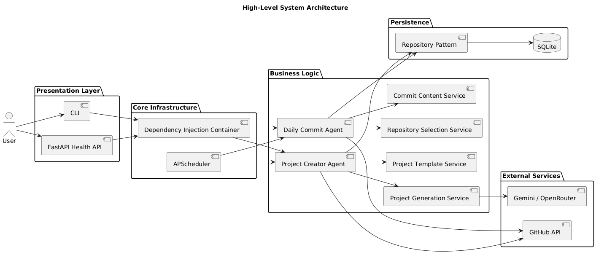

# GitHub Activity Automation

A production-ready Python system that automates GitHub activity and bootstraps new starter repositories.

The project includes:

- **Daily Commit Agent** for routine tracking commits
- **Project Creator Agent** for new repository creation and seeding
- **GitHub API integration** with authentication validation
- **SQLite persistence** for state, commit history, and creation metadata
- **AI-assisted project idea + README generation** with fallback behavior

## 1. Project Overview

This automation system keeps a GitHub account active and builds starter repositories automatically.
It selects eligible repositories, creates commit entries for tracking, generates project ideas, and seeds new repos with README, license, `.gitignore`, and starter code.

## Architecture Diagram



## 2. Prerequisites

- Python **3.12**
- Git
- GitHub account
- GitHub Personal Access Token
- Optional: Gemini API key for AI generation

## 3. Setup Instructions

```powershell
cd "F:\Bcommune's Assessment"
python -m venv .venv
.venv\Scripts\activate
pip install -r requirements.txt
copy .env.example .env
```

On macOS / Linux:

```bash
cd "F:\Bcommune's Assessment"
python -m venv .venv
source .venv/bin/activate
pip install -r requirements.txt
cp .env.example .env
```

## 4. Configuration Guide

The runtime configuration is stored in `config.yaml`.

### `enabled`

- `true` or `false`
- Global kill switch. When `false`, the agents exit before calling GitHub.

### `database.url`

- Example: `sqlite:///github_activity.db`
- Defines the SQLite database used for state and history.

### `github`

- `username`: fallback GitHub username
- `timeout_seconds`: GitHub API timeout in seconds
- `repository_filters.include_private`: include private repositories
- `repository_filters.include_public`: include public repositories
- `repository_filters.exclude_archived`: skip archived repositories
- `repository_filters.exclude_forks`: skip forked repositories
- `repository_filters.name_allowlist`: only allow named repositories
- `repository_filters.name_blocklist`: block named repositories

### `daily_commit`

- `tracking_filename`: file name written by the daily commit agent
- `min_commits`: minimum number of commits per run
- `max_commits`: maximum number of commits per run
- `commit_messages`: commit message options used randomly
- `force_allows_repeat_repository`: allow `--force` to reuse the previous repo

### `project_creator`

- `language`: `python` or `javascript`
- `default_license`: license string for seeded repos
- `gitignore_template`: gitignore template label
- `fallback_project_ideas`: deterministic project ideas when AI is unavailable
- `templates`: language-specific starter filename and requirements

### `ai`

- `provider`: `gemini` or `openrouter`
- `model`: model name used for AI requests
- `timeout_seconds`: AI request timeout
- `gemini_url`: Gemini endpoint template
- `openrouter_url`: OpenRouter endpoint
- `gemini_api_key`: loaded from `.env`
- `openrouter_api_key`: loaded from `.env`

### `scheduler`

- `timezone`: scheduler timezone
- `daily_commit_cron`: cron schedule for the daily commit agent
- `project_creator_cron`: cron schedule for project creation

### `runtime`

- `retry_count`: number of retries for API calls
- `retry_backoff_seconds`: delay between retries

### `logging`

- `level`: logging level
- `directory`: output log directory
- `filename`: log file name
- `max_bytes`: rotating log file size
- `backup_count`: number of rotated log files

## 5. API Key Setup

Copy `.env.example` to `.env` and populate your keys:

```env
GITHUB_TOKEN=github_pat_your_token_here
GITHUB_USERNAME=your-github-username
GEMINI_API_KEY=your-gemini-api-key
OPENROUTER_API_KEY=your-openrouter-api-key
```

### GitHub Personal Access Token

Create a token with repository access to allow reading and writing repository contents, plus repository creation if required.
Recommended scopes:

- `repo`
- `public_repo`

## 6. Running the Agents

Run the daily commit agent:

```powershell
python -m github_activity_automation.main daily-commit
```

Run the project creator agent:

```powershell
python -m github_activity_automation.main project-creator
```

Run daily commit with force reuse of the previous repository:

```powershell
python -m github_activity_automation.main daily-commit --force
```

## 7. Scheduling

The project uses APScheduler and cron expressions in `config.yaml`.

Example schedule:

- `daily_commit_cron: "0 9 * * *"` (every day at 09:00)
- `project_creator_cron: "0 10 * * MON"` (every Monday at 10:00)

To automate runs in production, use a system scheduler or process manager to invoke the desired agent command regularly.

## 8. Kill Switch

Setting `enabled: false` in `config.yaml` safely disables automation without changing code.
This stops GitHub calls and preserves the current configuration.

## 9. Troubleshooting

### `Gemini API failed with status 404`

- The AI model or endpoint is incorrect.
- Verify `ai.model` and `ai.gemini_url` in `config.yaml`.
- Make sure `GEMINI_API_KEY` is set and valid.

### `GITHUB_TOKEN is required when enabled is true`

- Set `GITHUB_TOKEN` in `.env`.
- Confirm the token has repository write permissions.

### `Permission denied` on `.pytest_tmp`

- Delete stale `.pytest_tmp` and rerun tests.
- Use a writable temp directory if needed.

## 10. Project Structure

```text
github_activity_automation/          # core application package
  agents/                           # automation agent workflows
  config/                           # YAML config loader and settings
  database/                         # SQLite models and session management
  github_client/                    # GitHub API wrapper
  models/                           # typed domain models
  repositories/                     # persistence repository layer
  scheduler/                        # APScheduler cron wiring
  services/                         # business logic and AI integration
  state/                            # execution state management
  utils/                            # helper utilities
  api.py                            # FastAPI health endpoint
  container.py                      # dependency wiring
  exceptions.py                     # project exceptions
  logging_config.py                 # structured logging configuration
  main.py                            # CLI entrypoint
tests/                              # pytest integration / unit tests
config.yaml                         # runtime configuration
.env.example                        # environment variable template
requirements.txt                    # Python dependencies
README.md                           # project documentation
```

## 11. Why this project stands out

- Clear architecture with separate agents, services, and repositories
- Safe kill switch to disable automation
- Retry/backoff support for external API calls
- AI generation plus deterministic fallback
- Persistent state and history tracking in SQLite
- Modular GitHub automation for commits and repository creation
- Configurable scheduling and logging

## --force Usage

```bash
python -m github_activity_automation.main daily-commit --force
```

`--force` allows the daily commit agent to select the previously committed repository when `daily_commit.force_allows_repeat_repository` is `true`.

## Scheduling Using APScheduler

The scheduler module builds jobs from `scheduler.daily_commit_cron` and `scheduler.project_creator_cron`. Jobs are not registered when the kill switch is disabled.

## Cron Setup

```cron
0 9 * * * cd /path/to/project && /path/to/python -m github_activity_automation.main daily-commit
0 10 * * MON cd /path/to/project && /path/to/python -m github_activity_automation.main project-creator
```

## Windows Task Scheduler

Create two basic tasks:

- Program: `python`
- Arguments: `-m github_activity_automation.main daily-commit`
- Start in: project directory

Repeat for:

- Arguments: `-m github_activity_automation.main project-creator`

## Kill Switch

Set:

```yaml
enabled: false
```

When disabled, the CLI exits before creating the GitHub client workflow or making GitHub API calls.

## Directory Structure

The source tree separates agents, services, database, GitHub client, utilities, config, scheduler, state manager, models, repositories, and tests. This keeps the two automation agents independent while sharing infrastructure.

## Design Decisions

## Why SQLite

SQLite is simple to operate, reliable for local automation, and sufficient for serialized agent execution without requiring database infrastructure.

## Why PyGithub

PyGithub provides a maintained Python abstraction over GitHub authentication, repository listing, file commits, and repository creation.

## Why SQLAlchemy

SQLAlchemy gives typed ORM models, migrations-ready structure, transactions, and a clean repository pattern over SQLite.

## Why FastAPI

FastAPI provides a lightweight operational app surface and keeps the architecture ready for future API-triggered execution without changing agent internals.

## Security

- Secrets are loaded from `.env`, not committed.
- The kill switch prevents external API calls.
- Tokens should use the least required GitHub scopes.
- Logs avoid writing secret values.
- `.gitignore` excludes local databases, logs, virtual environments, and `.env`.

## Future Improvements

- Add Alembic migrations.
- Add Prometheus metrics.
- Add webhook-triggered execution.
- Add richer project templates.
- Add distributed locking for multi-host scheduling.

## License

MIT

## Contributing

Open a focused pull request with tests for behavior changes. Keep modules small, typed, and aligned with the existing clean architecture boundaries.
